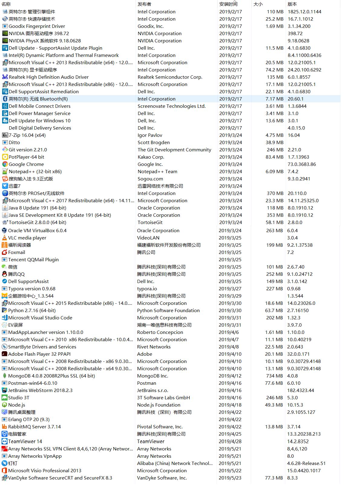

# Windows环境搭建

## 软件列表

7-zip
PotPlayer
EV 录屏
Chrome
搜狗输入法
NotePad++
Typro
迅雷7
福昕阅读器
Foxmail
微信
QQ
钉钉
腾讯桌面整理
TeamViewer14
Ditto
DuplicateFileCleaner
FileZilla FTP Client
Array NetWorks SSL VPN
Beyond Compare 3
VirtualBox
Micro Soft Visio professional 2013
MicroSoft Office
Snipaste-1.16.2-x64
DTLite

VS code
JetBrains idea
sts-4.2.2.RELEASE
WebStorm
eclipse

Java 8
Node.js
python
Git
TortoiseGit
TortoiseSVN

Postman
Navicat
Studio-3T
PLSQL_Developer/Oracle Instant Client
VanDyke SecureCRT and Secure FX 8.3

maven
nginx
MongoDB
MySQL
tomcat
Erlang OTP
RabbitMQ
